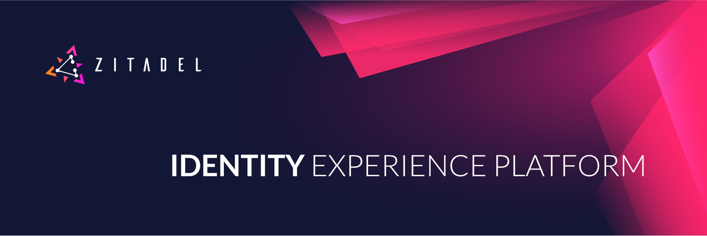

  

ZITADEL is the modern open* alternative for Auth0, Firebase Auth, AWS Cognito as well as Keycloak built for the serverless era. We provide a wide range of out of the box features like secure login, self-service, OpenID Connect, OAuth2.x, SAML2, branding, Passwordless with FIDO2, OTP, U2F, unlimited audit trail to improve the life of developers. Especially noteworthy is that ZITADEL supports not only B2C and B2E scenarios but also B2B. This is especially useful for builders who build B2B Solutions as ZITADEL can handle all the delegated user and access management.
With ZITADEL you rely on a battle tested, hardened and extensible turnkey solution to solve all of your authentication and authorization needs. The unique way ZITADEL stores its data gives our users an unlimited audit trail which provides a peace of mind for even the harshest audit and analytics requirements.

## ZITADEL Cloud

The best way to get started with ZITADEL is to use our public cloud service which provides a gracious [free tier](https://zitadel.ch/pricing/v2) to anybody that wants to use ZITADEL even without a credit card.

If you are ready to scale your projects you can harness the full potential of our pay-as-you-go plan and profit from things like a custom domain, sla, support and the ability to select a region or country where we store your data.

## ZITADEL Self-Hosting

Whether you want to test ZITADEL locally, deploy it to Kubernetes or even use a Serverless offering like Google Cloud Run, we got you covered!
 
- [Start Locally](TBD) TODO Link Guide of v2 here
- [Deploy to Google Cloud Run](TBD) TODO Link Guide of v2 here
 
> If you are in need for a self-hosted ZITADEL instance and want to have support [please reach out to us](https://zitadel.ch/contact)!

## ZITADEL Open Source Projects

- [oidc-go](https://github.com/zitadel/oidc-go) is our open source OpenID Connect Go library powering also ZITADEL. To show our ongoing commitment to open source and Go we were the first to certify a Go library with the OpenID Foundation. This library is able to act as client (rp) and server (op) likewise.
- [zitadel-go](https://github.com/zitadel/zitadel-go) helps builders who use Go with an easy to use SDK to access ZITADEL's APIs.

## More Information

- [ZITADEL Roadmap](https://zitadel.ch/roadmap) if you are interested on what we are currently working.
- [ZITADEL Chat](https://zitadel.ch/chat) come and interact with us in our discord chat. All questions allowed!
- [ZITADEL Blog](https://zitadel.ch/blog) is the place where we actively communicate news and other content around ZITADEL and its capabilities.